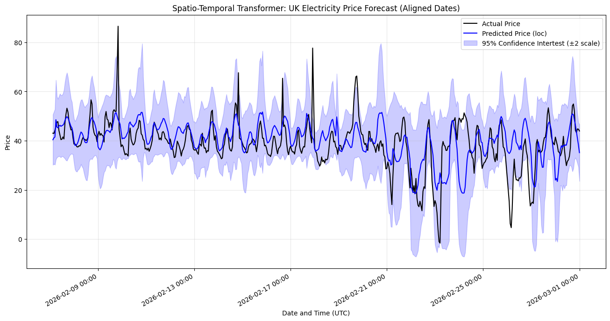

# UK Day-Ahead Electricity Price Forecasting

Academic Advanced ML project: a **spatio-temporal probabilistic Transformer** (Megatron / STPT) that forecasts UK wholesale electricity prices from historical prices, commodity markets, and a UK-wide weather grid.

**Test set (Jan–Mar 2026):** MAE **£5.49** · RMSE **£7.69** — beating Linear Regression and XGBoost on the same task.

<p align="center">
  
</p>
<p align="center"><em>Point forecast and Student-t uncertainty on a sample of the test set.</em></p>

---

## Why this problem is hard

UK wholesale prices are set by the last (marginal) plant needed to meet demand — often a gas-fired CCGT. Wind and solar are cheap but intermittent, so a calm, cloudy winter evening can force the grid onto expensive gas and produce sharp spikes. Excess renewable output can push prices toward zero or negative.

Electricity is essentially non-storable and must be balanced in real time. That makes the series:

- **heavy-tailed** (spikes, negative prices)
- **seasonal** (hour, weekday, heating/cooling)
- **driven by space** (North Sea wind vs London demand vs Cornwall solar)

Classical linear models miss those interactions. This project builds a model that sees both the **map of UK weather** and the **market state**, and that reports **uncertainty**, not only a point forecast.

A longer write-up (methods, equations, discussion) is in [`REPORT.md`](REPORT.md).

## Results

| Model | MAE | RMSE |
| --- | ---: | ---: |
| Linear Regression | 11.22 | 14.67 |
| XGBoost | 10.75 | 14.52 |
| **STPT (this project)** | **8.77** | **12.57** |

Validation set used for model selection. On the **held-out test set** (2026-01-01 → 2026-03-01) STPT reached **MAE 5.49** and **RMSE 7.69**. Empirical coverage of the nominal 95% interval was **99.0%**: the model is slightly conservative (wide bands), which is preferable in a risk-averse trading setting.

| Split | Dates |
| --- | --- |
| Train | 2023-03-02 → 2025-09-01 |
| Validation | 2025-09-01 → 2025-12-31 |
| Test | 2026-01-01 → 2026-03-01 |

The test window was cut before March 2026 so results are not mixed with the Strait of Hormuz commodity shock.

## Architecture

Megatron is a **Spatio-Temporal Probabilistic Transformer**:

```text
8×8 weather grid (wind, temperature, cloud)     scalar series (price, volume,
        │                                        oil, gas, calendar)
        ▼                                                │
 Residual CNN (2× ResBlocks)                             │
        │                                                │
        └──────── concat per hour ───────────────────────┘
                          │
                 linear projection (d=84)
                 + sinusoidal positional encoding
                          │
              Transformer encoder (4 layers, 12 heads)
                          │
              dual-state fusion: last step ⊕ sequence mean
                          │
              Student-t head  →  (ν, μ, σ)  for the 24h-ahead price
```

- **Lookback:** 168 hours (7 days)
- **Horizon:** 24 hours (day-ahead)
- **Loss:** negative log-likelihood of a Student-t distribution (heavy tails, learned degrees of freedom)
- **Training:** AdamW (`lr=3e-4`), gradient clipping, dropout 0.3, ReduceLROnPlateau — on an NVIDIA RTX 4060

Baselines in `notebook_1.ipynb` use only a few weather *points* (London, North Sea, Cornwall). STPT instead reads an **8×8 spatial field**, so it can pick up regional supply (offshore wind) and demand (urban temperature) at the same time.

## Data

Three public sources, aligned to hourly resolution (March 2023 – March 2026):

| Source | What we take |
| --- | --- |
| [Elexon Insights / BMRS](https://data.elexon.co.uk/) | Settlement price and volume |
| [Open-Meteo Historical Weather](https://open-meteo.com/en/docs/historical-weather-api) | Temperature, 100 m wind, cloud cover on an 8×8 UK grid (49–60°N, 9°W–2°E), plus point sites |
| [Yahoo Finance](https://finance.yahoo.com/) via `yfinance` | TTF gas (`TTF=F`) and Brent oil (`BZ=F`) |

Cleaning (see report for details):

- daily oil/gas **forward-filled** to hourly
- 30-minute prices/volumes **resampled** to 1 hour
- short gaps **linearly interpolated** (Transformers need a continuous sequence)
- **asymmetric IQR clip** (3× IQR below, 6× IQR above) so spikes and negative prices are damped but not erased
- calendar features: hour, weekday, day of year
- `StandardScaler` fitted **on the training set only**

Pre-built CSVs are in this repo, so you do not need API keys to train or evaluate.

## Repository layout

```text
.
├── README.md
├── REPORT.md                          full methods + discussion
├── requirements.txt
├── notebook_1.ipynb                   Elexon + point weather + commodities; LR / XGBoost
├── data_exctration.ipynb              Open-Meteo 8×8 (and denser) grid download
├── EDA.ipynb                          distributions, seasonality, correlations
├── transformer_grid_weather.ipynb     STPT training, validation, test plots
├── price_commo_2023_2026.csv          master tabular dataset (~6 MB)
├── grid_weather_8x8_2023-2026.csv     hourly 8×8 weather (~45 MB)
├── transformer_model_8_8_grid.pth     trained PyTorch weights (~2.7 MB)
└── figures/                           plots used in README and REPORT
```

Suggested order if you re-run everything:

1. `notebook_1.ipynb` — refresh prices, point weather, oil/gas *(needs network)*
2. `data_exctration.ipynb` — rebuild the weather grid *(slow; uses Open-Meteo archive)*
3. `EDA.ipynb` — inspect the merged table
4. `transformer_grid_weather.ipynb` — train / load STPT and score it

To **only inspect results**, open `EDA.ipynb` and `transformer_grid_weather.ipynb` with the CSVs and `.pth` already in this folder.

## Setup

Python 3.10+ recommended. GPU optional (PyTorch CUDA speeds up training).

```bash
python -m venv .venv
# Windows
.venv\Scripts\activate
# macOS / Linux
# source .venv/bin/activate

pip install -r requirements.txt
jupyter notebook
```

Training the Transformer uses **PyTorch**. TensorFlow is not required (a leftover import in two notebooks can be ignored).

## Limitations (honest)

- Evaluation uses **observed** weather on the forecast day, not a day-ahead weather *forecast*. A production system would see noisy NWP input.
- The sample starts in 2023, so the 2022 energy-crisis regime is excluded by design.
- Spikes are still hard: the point forecast regresses toward the mean; the Student-t bands widen instead.
- Interval coverage (99% vs 95%) shows the uncertainty head is not perfectly calibrated.

Possible extensions: historical forecast archives (or synthetic weather noise), plant outages, bank holidays, and coupled prices/weather in France, Ireland, and the Netherlands.

## Licence and data terms

This is an academic project, not trading advice. Redistribute code as you like for non-commercial use. Underlying series remain subject to [Elexon](https://www.elexon.co.uk/), [Open-Meteo](https://open-meteo.com/), and Yahoo Finance terms.
